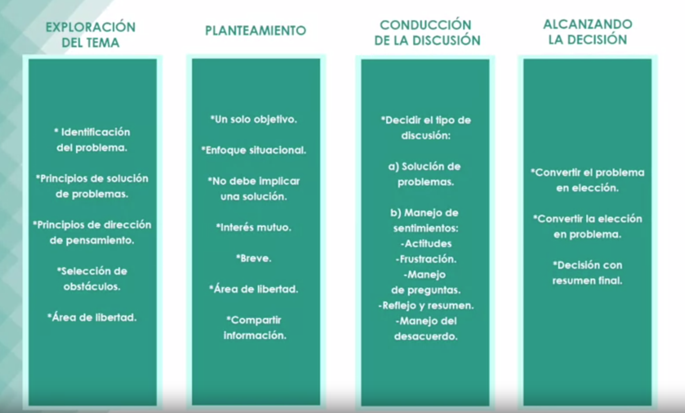

# Solución de problemas y toma de decisiones

- [Solución de problemas y toma de decisiones](#solución-de-problemas-y-toma-de-decisiones)
  - [Método de exploracion de problemas](#método-de-exploracion-de-problemas)
    - [Identificación de obstáculos](#identificación-de-obstáculos)
    - [Método causal](#método-causal)
  - [Principios de dirección del pensamiento](#principios-de-dirección-del-pensamiento)
    - [Exploración del problema - Ubicación del problema](#exploración-del-problema---ubicación-del-problema)
  - [Selección de obstáculos](#selección-de-obstáculos)
    - [El área de libertad del directivo en la toma de decisiones](#el-área-de-libertad-del-directivo-en-la-toma-de-decisiones)
    - [Procesos mentales en la toma de decisiones](#procesos-mentales-en-la-toma-de-decisiones)
      - [¿Cómo aplica el líder esas soluciones?](#cómo-aplica-el-líder-esas-soluciones)
  - [Elementos para involucrar al personal en la toma de decisiones](#elementos-para-involucrar-al-personal-en-la-toma-de-decisiones)
    - [Principio 5 de Norman Maier](#principio-5-de-norman-maier)
  - [Aceptación y calidad](#aceptación-y-calidad)
    - [Principios 7 y 8 de  Norman Maier](#principios-7-y-8-de--norman-maier)
  - [Resumen](#resumen)

**Definición de problema** Una situación problemática es cuando nuestra acción previa se ve detenida por la presencia de uno o más obstáculos que nos están impidiendo llegar a la meta.

¿Como podemos resolver el problema?

1. Removiendo en obstáculo
2. Rodeando el obstáculo
3. Anticipando el obstáculo

Tan importante como resolver el problema, es tenerlo perfectamente definido para después tomar acciones para resolverlo.

Según el psicólogo conductual Norman R.F. Maier, en el 66% de las veces que volvemos sobre la solución de un problema, mejoramos esta solución.

Principios para resolver problemas (Norman Maier):

1. La solución exitosa del problema requier que el esfuerzo sea dirdigido hacia el vencimiento de obstáculos superables
2. Debemos usar toda la información disponible, aún cuando esta nos parezca inadecuada.
3. El punto de partida de un problema nos ofrece nos ofrece mayor riqueza en posibilidades de solución.
4. El estar orientado hacia el problema debe ser estimulado, mientras que el estar orientado hacia la solución debe ser postpuesto.
5. El desacuerdo puede conducir tanto hacia hostilidad como hacia innovación, dependiendo de las habilidades de liderazgo en la discusión.
6. La "obtención de la idea" es un proceso que debe ser separado de la "evaluación de la idea", porque ést inhibe aquél.
7. Las situaciones problemáticas deben ser convertidas a situaciones de elección.
8. Las situaciones de elección deber convertidas a situaciones problemáticas.
9. Las soluciones sugeridas por el líder suelen ser imporpiamente valoradas y tienenla misma oportunidad de ser rechazadas que aceptadas por el grupo.

## Método de exploracion de problemas

### Identificación de obstáculos

Buscar lo que no impide llegar a la meta que tenemos como objetivo.

### Método causal

Buscamos las causas de los problemas y tendemos a solucionar esas causas sin reparar en los obstáculos que impiden la solución.

## Principios de dirección del pensamiento

Nos ayudan a localizar los obstáculos que nos impiden llegar a nuestra meta.

1. El pensamiento toma direcciones. Las primeras direcciones que toma el pensamiento son las ideas habituales
2. Las ideas habituales no pueden evitare, pero sí pueden ser relegadas.
3. Al inhibir una dirección de pensamiento habitual, surgen otras ideas más creativas.
4. El gran engaño de las ideas habituales es que aperentan resolver el problema.
5. La cercanía al éxito per con una dirección de pensamiento equivocada produce obstinación.
6. Una vez que el pensamiento avanzó en una determinada dirección, el proceso es prácticamente irreversible a menos que:
   1. Se postponga la solución.
   2. Se recomience en el punto de partida (cambia la percepción)

### Exploración del problema - Ubicación del problema

Nos permitirá ubicar ciertos obstáculos que nos impiden alcanzar las metas, es importante mantener una actitud de 
investigación de la situación y posponer la ideas habituales.

1. **Poner el problema como punto de partida:** La solución adecuada de los problemas depende de dónde esté el problema, lo que influirá en el enfoque que se tome. Es importante descubrir qué enfoques son factibles. Hay que dedicar tiempo a la investigación, elección y definición del punto de partida. El éxito o fracaso en la solución del problema depende de si puede eludirse o no el obstáculo localizado. Encontrar los obstáculos eludibles es clave para resolver el problema.
2. **Localizar los obstáculos que se pueden superar:** Cuando nos enfrentamos a una situación en que hay muchas soluciones posibles, el procesos de solución se reduce a seleccionar la mejor manera de resolverlos en cada caso, que dependerá del costo, facilidad de ejecución, preferencias personales, etc.

Podríamos definir estos principios para resolver problemas:

- Buscar obstáculos no comunes o nuevos enfoques a seguir.
- No persistir en un punto de partida si no es productivo.
- La proximidad del éxito no debe engañar, cando estamos cerca del éxito hacemos modificaciones menores que no tienen porqué conducir al éxito.

La solución de problemas en grupo (_brainstorming_), siempre que el conductor explique estos principios y se centre en conducir la dinámica del grupo más que en la solución, puede dar lugar a enfoques alternativos.

## Selección de obstáculos

Revisaremos el área de libertad que tiene un directivo para seleccionar estos obstáculos en superables y en insuperables de acuerdo a las posibilidades que tenga el directivo de resorlverlos.

**Primer principio de Maier**: la solución exitosa de problemas requiere que el esfuerzo sea dirigido hacia el vencimiento de obstáculos superables. Necesitamos no enfocarnos en los obstáculos que no tienen solución.

### El área de libertad del directivo en la toma de decisiones

El puesto en sí otorga o faculta al directivo para tomar las decisiones de acuerdo a la función que él está desempeñando. Sin embargo, hay aspectos que su propio puesto o la empresa limitan esta libertad, ¿cuáles son estos aspectos?

- Las propias políticas de la empresa. Las políticas de la empresa de alguna manera nos restringen en que hay aspectos que por más que nosotros tengamos una muy buena idea para solucionar un problema si es contrario a las políticas no lo podemos aplicar.
- La legislación. Toda la normatividad que tiene nuestro puesto de trabajo y nuestra empresa nos impide tomar cualquier decisión por muy acertada que ésta sea. Los convenios sindicales.
- El convenio sindical. Nosotros podemos estar seguros de que tenemos que tomar determinada decisión con algún grupo de trabajadores. Pero si el convenio sindical no nos faculta, y nos impide tomar esa decisión que sería la mejor para la empresa, no lo vamos a poder hacer.
- Los mismos procedimientos de trabajo de la empresa. Por más que nosotros queramos de alguna forma resolver un problema contrario a los procedimientos normales de la institución, no lo podremos hacer.
- Hay temas en que no nos podemos meter. Nosotros no tenemos ninguna experiencia de cuál es el software que tiene que comprar la empresa. Eso lo tienen que resolver los expertos, son temas que requieren ser consultados y, en muchas ocasiones, ni siquiera con personal de la propia institución, sino con expertos, consultores, que vienen a asesorarnos en cuál es el equipo que tenemos que manejar.

### Procesos mentales en la toma de decisiones

Una decesión tiene dos momentos, obtención de la idea y evaluacion de la misma.

Con el método de _ensayo y error_ el acierto aparente inhibe la exploración de otras ideas.

**Principo 6 de Norman Maier**: La obtención de la idea es un proceso que debe ser separado de la evaluación de la idea, porque este inhibe a aquél.

Primero debemos dejar que aparezcan todas las ideas, las habituales y las más crativas. Una vez que aparezcan todas, evaluemos cuál es la mejor solución.

Para que una decisión sea evectiva necesita:

1. Que la solución sea efectiva (tenga calidad): a la solución se debe llegar por razonamiento.
2. Que la solución tenga aceptación por las personas que deben aplicar la solución. Hacer partícipes a las personas que tienen que aplicar la solución en el diseño de esta solución.

#### ¿Cómo aplica el líder esas soluciones?

**Principio 9 de Norman Maier**: Las soluciones sugeridas por el líder suelen ser impropiamente valoradas y tienen la misma oportunidad de ser rechazadas o aceptadas por el grupo.

## Elementos para involucrar al personal en la toma de decisiones

Principios de planteamiento del problema:

1. **Localización de un solo objetivo:** cuando queremos solucionar un problema con apoyo del grupo es conveniente plantear un solo propósito para evitar que el grupo divague o se pierda el objetivo principal de la reunión.
2. **Presentar el Problema en términos de Situación y no de Conducta:** para evitar que el personal actué a la defensiva debemos tratar de serdescriptivos sobre el hecho que queremos mejorar, evitando mencionar que el problema se debe a problemas del personal, por ejemplo; si decimos los llamé para investigar las causas de que estén teniendo muchos accidentes en el trabajo implícitamente estamos dando por hecho que los trabajadores están ocasionando los accidentes, un planteamiento situacional sería: los mandé reunir para analizar cuáles serían las actividades que podríamos realizar para mejorar la seguridad en nuestra planta.
3. **El planteamiento del Problema no debe implicar una solución:**  es común que en el propio planteamiento un jefe sugiera la solución del problema al decir “ ¿qué proponen que hagamos con los retardos que están afectando la productividad?” en este planteamiento el jefe ya está dando por hecho que la solución es reducir los retardos, sería mucho mejor un planteamiento que dijera ¿qué podemos hacer para mejorar nuestros índices de productividad? Y dejar que las soluciones vengan del grupo y den por descontado que una de ellas será la de reducir los retardos.
4. **El Problema debe ser expresado en términos de Interés Mutuo:**  el planteamiento sobre la productividad del ejemplo anterior mejoraría mucho si lo completáramos de la siguiente manera: ¿qué podemos hacer para mejorar nuestros índices de productividad de tal manera que todos podamos obtener siempre el bono de productividad?
5. **El Planteamiento debe ser breve:** grandes discursos cansan y el trabajador deja de prestar atención.
6. **El Planteamiento deberá respetar el área de libertad del directivo:** Obviamente no podemos pedirle a la gente que resuelva aspectos que ni nosotros podemos solucionar.
7. **El Directivo debe compartir en el planteamiento la información esencial:** no esperemos soluciones efectivas del personal si no les damos oportunidad de contar con toda la información sobre el problema.

### Principio 5 de Norman Maier

El desacuerdo puede conducir tanto hacia la hostilidad como hacia la innovación, dependiendo de las habilidades del liderazgo en la discusión.

## Aceptación y calidad

Estos son elementos básicos para alcanzar una decisión efectiva e integral.

Para obtener la aceptación, necesitamos desarrollar habilidades sobre todo en el manejo de la discusión, en el tema de sentimientos y actitudes. Podemos echar mano de tres técnicas:

1. Escucha activa, con una posición neutral.
2. Dejar que fluyan los sentimientos.
3. Manejo de preguntas.

Hacer recapitulaciones de lo que se ha dicho o acordado.

### Principios 7 y 8 de  Norman Maier

Las situaciones problemáticas debemos de convertirlas en situaciones de elección. Y las situaciones de elección las debemos de convertir en situaciones problemáticas.

## Resumen

